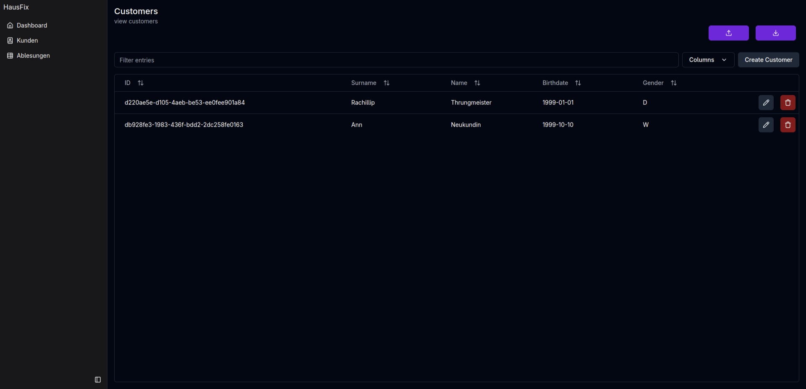
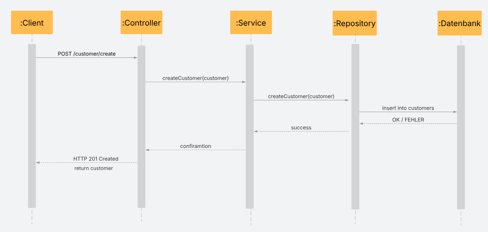
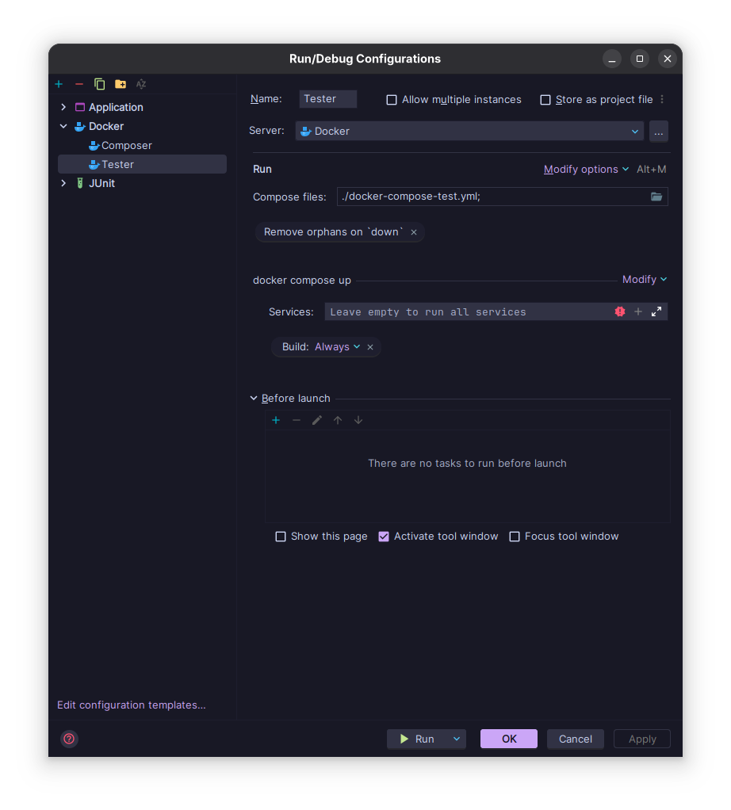

<a id="readme-top"></a>

[![Contributors][contributors-shield]][contributors-url]
[![Forks][forks-shield]][forks-url]
[![Stargazers][stars-shield]][stars-url]
[![Issues][issues-shield]][issues-url]

<!-- PROJECT LOGO -->

<br />
<div align="center">
  <a href="https://github.com/thenightness/HausFix">
    
  </a>
<h1 align="center">HausFix</h1>

  <p align="center">
    3FA081 Gruppe C
  </p>
</div>


## Inhaltsverzeichnis

- [Setup & Installation](#setup--installation)
   - [Tech Stack](#tech-stack)
   - [Voraussetzungen](#voraussetzungen)
   - [Repository clonen](#repository-clonen)
   - [NPM packages installieren](#npm-packages-installieren)
   - [.env Dateien einrichten](#env-dateien-einrichten)
   - [Umbenennen der remote URL](#umbenennen-der-remote-url)
   - [Startbefehl](#startbefehl)
- [REST API Übersicht](#übersicht)
- [Testing](#testing)

## User Interface
<p align="center">
  
</p>

## Setup & Installation

### Tech Stack
* [![Svelte][Svelte.dev]][Svelte-url]
* [![MariaDB][Mariadb.org]][Mariadb-url]
* [![Docker][Docker.com]][Docker-url]
* [![Java][Java.com]][Java-url]
* [![Maven][Maven.Apache.org]][Maven-url]

### Voraussetzungen

Zur Verwendung der Software wird Folgendes benötigt:
- [Docker](https://www.docker.com/)
- [Docker Compose](https://docs.docker.com/compose/)
- [Maven](https://maven.apache.org/download.cgi) (Backend)
- [Node.js & npm](https://nodejs.org/) (Frontend)

### Repository clonen
   ```sh
   git clone https://github.com/thenightness/HausFix.git
   ```
### NPM packages installieren
   ```sh
   npm install
   ```
### .env Dateien einrichten

Führe folgende Schritte für die Ordner `HausFix` und  `Frontend` durch:

1. Erstelle eine `.env` Datei im jeweiligen Ordner.
2. Kopiere den Inhalt aus der `.env.example`:
   ```bash
   cp .env.example .env
3. Passe die Umgebungsvariablen in .env an

### Umbenennen der remote URL
Change git remote url to avoid accidental pushes to base project
Ändere die git remote url um unbeabsichtigte pushs ins Base Projekts zu verhindern
   ```sh
   git remote set-url origin thenightness/HausFix
   git remote -v # confirm the changes
   ```
### Startbefehl
Für die Startbefehle von Frontend und Backend werden zwei Terminals gebraucht.


```bash
//Backend Terminal
docker compose up --build 
```


```bash
//Frontend Terminal
cd .\frontend\
npm run dev
```
Damit wird:
- Die MariaDB-Datenbank mit port 3306 gestartet
- Das Java-Backend (REST-API) auf Port 42069 gestartet
- Das Frontend gestartet in LocalHost auf http://localhost:5173/ gestartet

### Übersicht

Aktionen aus dem Frontend werden per REST-API weitergegeben. Siehe folgende Ordner
```
src/main/java/customers
├──CustomerController
├──CustomerRepository
└──CustomerService

src/main/java/reading
├──ReadingController
├──ReadingRepository
└──ReadingService
```

<p align="center">
  
</p>

## Testing
Unit-Tests wurden mit JUnit geschrieben. Um diese auszuführen muss eine Run/Debug Configuration hinzugefügt werden.
Diese führt die `docker-compose-test.yml` aus. Beim Ausführen dieser werden alle Tests ausgeführt

<p align="center">
  
</p>

<p align="right">(<a href="#readme-top">back to top</a>)</p>


## Top contributors:

<a href="https://github.com/thenightness/HausFix/graphs/contributors">
  
</a>

<!-- MARKDOWN LINKS & IMAGES -->
<!-- https://www.markdownguide.org/basic-syntax/#reference-style-links -->
[contributors-shield]: https://img.shields.io/github/contributors/thenightness/HausFix.svg?style=for-the-badge
[contributors-url]: https://github.com/thenightness/HausFix/graphs/contributors
[forks-shield]: https://img.shields.io/github/forks/thenightness/HausFix.svg?style=for-the-badge
[forks-url]: https://github.com/thenightness/HausFix/network/members
[stars-shield]: https://img.shields.io/github/stars/thenightness/HausFix.svg?style=for-the-badge
[stars-url]: https://github.com/thenightness/HausFix/stargazers
[issues-shield]: https://img.shields.io/github/issues/thenightness/HausFix.svg?style=for-the-badge
[issues-url]: https://github.com/thenightness/HausFix/issues
[hausfix-screenshot]: images/screenshot.png
[Svelte.dev]: https://img.shields.io/badge/Svelte-4A4A55?logo=svelte&logoColor=FF3E00
[Svelte-url]: https://svelte.dev/
[Mariadb.org]: https://img.shields.io/badge/MariaDB-C0765A?logo=mariadb&logoColor=white
[Mariadb-url]: https://mariadb.org/
[Docker.com]: https://img.shields.io/badge/Docker-328EEF?logo=docker&logoColor=white
[Docker-url]: https://www.docker.com/
[Java.com]: https://img.shields.io/badge/Java-ea2f30?logoColor=white
[Java-url]: https://www.java.com/de/
[Maven.Apache.org]: https://img.shields.io/badge/Maven-C7203E?logo=apachemaven&logoColor=white
[Maven-url]: https://maven.apache.org/